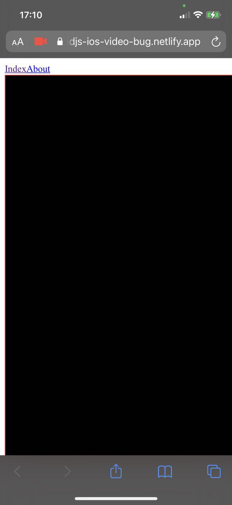

# solidjs-ios-video-bug

## Bug description

To reproduce bug:

1. Open this URL https://solidjs-ios-video-bug.netlify.app/ in iOS Safari
2. Click on rectangle with red broder
3. You would see black rectangle

### Expected behviour

If you would compare same feature implemented in vanila HTML/JS https://solidjs-ios-video-bug.netlify.app/baseline.html. It works as expected - it shows video from camera

## Other

Everything you need to build a Solid project, powered by [`solid-start`](https://start.solidjs.com);
